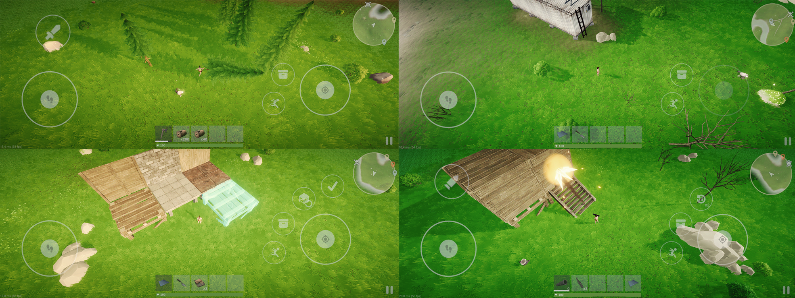
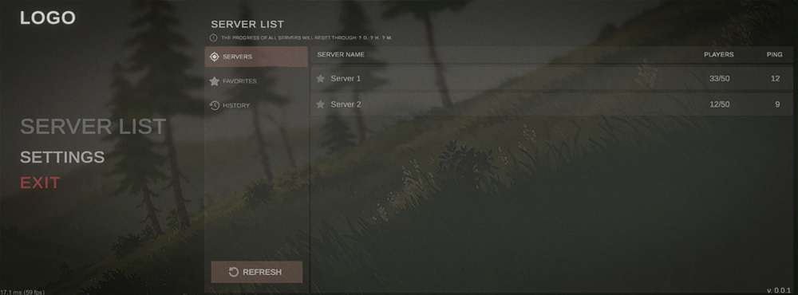

**Mobile multiplayer online game** · Unity · C# · Mirror Networking

Also available in: [Russian](README_ru.md)

A persistent, competitive multiplayer survival project built in Unity. Players start with empty hands, gather resources, craft gear, build and defend their base, and fight other players for resources on shared servers running server-authoritative simulation. The project spans the full stack: the game client, the networked server simulation, a lightweight backend service, and cloud save storage.

## Table of Contents

- [Screenshots](#screenshots)
- [Core Gameplay Features](#core-gameplay-features)
- [Technical Architecture](#technical-architecture)
- [Tech Stack](#tech-stack)
- [Project Structure](#project-structure)
- [Notes](#notes)

## Screenshots

<p align="center">
  
  <br>
  <em>Gameplay demonstration.</em>
</p>

<p align="center">
  
  <br>
  <em>Main menu interface.</em>
</p>

## Core Gameplay Features

### Base Building & Defense
- Foundations, walls, floors, doorways, stairs, triangular pieces, barricades, and utility structures - workbenches (3 tiers), furnaces, chests, sleeping bags and beds, and repair benches.
- Three building material tiers: wood → stone → metal, upgradable per individual piece.
- **Graph-based structural stability system**: each piece propagates a stability value from supporting pieces (foundations) through connected neighbors, with configurable falloff per piece type. A piece can't be placed without sufficient stability *or* direct support from terrain/foundation, and destroying a supporting piece can trigger a chain collapse of everything that depended on it.
- **Tool Cupboard-style territory system**: authorizes specific players to build within a claimed radius, requires periodic resource upkeep payments so structures don't "decay," and applies a temporary base-wide raid block when something is destroyed by an unauthorized player.

### Survival & Crafting
- Gather wood, stone, metal and sulfur ore, and other resources from harvestable/gatherable world objects.
- Tiered workbenches unlock crafting recipes for gear.
- Item durability decreases with use and is restored at a repair bench.
- Food and medical items restore health; sleeping bags and beds act as personal respawn points with separate cooldown timers.
- On death, the player's inventory drops into a container at the death location, and a marker appears on the map showing where they died.

### Combat
- Melee combat, firearms, thrown weapons, and explosives are all available.
- Hit registration and damage are validated server-side, with damage overrides by target type.
- Configurable **aim assist** that highlights/attacks valid targets under the crosshair.

### World & Environment
- Server-authoritative day/night cycle.
- Water volumes with per-float buoyancy physics and drowning mechanics.
- A **visibility/"hiding"** system (`Hider`) that fades out walls, floors, and interior objects when they block the camera's view of the player's own base.
- A minimap and full-screen map with pinch-zoom/pan, player-placed markers, and automatic death markers.

### Multiplayer & Live Service
- **Server browser**: real-time server list, ping, favorites, and recent-connection history.
- **Autosave** on dedicated servers, plus **backup/restore to S3**.

## Technical Architecture

### App & Scene Loading Flow

The game loads through four scenes, each owning its own [VContainer](https://github.com/hadashiA/VContainer) `LifetimeScope` and an `IStartable` entry point (a "flow"):

```
Bootstrap  →  Loading  →  Meta (main menu)  →  Core (gameplay)
```

- **Bootstrap** - the persistent root; registers cross-cutting services (settings, backend client) and hands off control to the Loading scene.
- **Loading** - checks client version compatibility before letting the player proceed.
- **Meta** - the main menu: server browser and settings.
- **Core** - the gameplay scene. A shared async `LoadingService` sequentially awaits every gameplay-critical `ILoadUnit` (building, saves, authorization, minimap persistence, dedicated-server backup, dev tools...).

### Networking (Mirror)

- Server-authoritative gameplay with headless server support.
- Custom `NetworkClient` spawn handlers.
- **Custom item sync layer**: inventory items aren't `NetworkBehaviour`s, so Mirror's Weaver-generated `[SyncVar]` / `[Command]` / `[ClientRpc]` can't be attached to them directly. A small reflection-based layer (`CustomSyncVar`, `CustomCommand`, `CustomClientRpc`) discovers tagged fields on any `BaseItem` and routes their sync/commands/RPCs through the owning `Inventory` (an actual `NetworkBehaviour`) - giving items fully networked state.

### Saves & Persistence

- Save handling is attribute-driven: any field/property marked `[SaveHandler.Saved]` on any component is automatically discovered via reflection, serialized (QuickSave + Newtonsoft.Json), and restored, with no hand-written (de)serialization code needed per entity type.
- A custom spawn handler is registered for each saveable type: loading a save restores objects through normal game logic and DI, rather than a "blind" `Instantiate`.
- Dedicated servers autosave at a set interval and back up/restore the save file to an S3-compatible bucket.

### Performance & World Systems

- **Custom grass system** (`GrassData`/`GrassGenerator`): placement is baked in the editor into a binary format, split into a uniform spatial grid, and queried at runtime via chunk-based lookups.
- **Dual-mode LOD system** (`LodLayer`/`LayerSettings`): supports both Unity's standard screen-relative-height LODs and a level-designer-friendly "distance in meters" mode, automatically recalculated from the camera's field of view.
- A general-purpose object pool (`PoolService`) serves VFX, debris, and projectiles.
- An editor-baked ground color map renderer for generating a large-scale terrain color texture.

### Interaction, UI & Input

- A proximity-based object interaction system (`InteractionSeeker`/`InteractionHandler`) with search layers (loot vs. structures).
- A reusable, touch-first **radial menu** (press–drag–release) drives weapon actions, item switching, and building repair/upgrade/demolish.
- An abstracted input layer (`BaseInput`/`BaseCameraInput`) with separate mobile and PC implementations behind a single interface.
- Localized UI (Unity Localization) with a custom smart-string helper supporting built-in `{Key}` substitution and typed variables.

## Tech Stack

| Category | Technology |
|---|---|
| Engine | Unity, Universal Render Pipeline (URP) |
| Networking | [Mirror Networking](https://mirror-networking.com/) |
| Dependency Injection | [VContainer](https://github.com/hadashiA/VContainer) |
| Async | [UniTask](https://github.com/Cysharp/UniTask) |
| Audio | FMOD for Unity |
| Character Controller | Kinematic Character Controller (KCC) |
| Save System | QuickSave + Newtonsoft.Json |
| Backup | AWS SDK for .NET (Amazon S3) |
| Localization | Unity Localization |
| UI | TextMeshPro, Unity UI Extensions |
| Other | Cinemachine, In-game Debug Console |

*Listed third-party packages/assets are not included in the repository.*

## Project Structure

```
+-- Assets
|   +-- _Project
|       +-- Develop
|           +-- SP
|               +-- Runtime
|               |   +-- Bootstrap        # App entry point: startup, settings loading
|               |   +-- Loading          # Loading scene: version check → Meta
|               |   +-- Meta             # Main menu: server browser, settings, network startup
|               |   +-- Core             # Gameplay scene root
|               |   |   +-- Camera       # PC/mobile input and cameras
|               |   |   +-- Entities     # Players, structures, resources, containers, harvestable nodes
|               |   |   +-- Environment  # Vegetation and background world dressing
|               |   |   +-- Items        # Inventory items
|               |   |   +-- Movement     # Character controller
|               |   |   +-- Objects      # Projectiles, explosives, physics objects
|               |   |   +-- Services     # Saves, authorization, building, environment, resources...
|               |   |   +-- Systems      # Building, crafting, inventory, interaction, LOD, grass...
|               |   |   +-- UI           # HUD, inventory, crafting, minimap, radial menus, settings
|               |   +-- Localization
|               |   +-- Utilities
|               +-- Editor               # Custom inspectors + level design tools
```

## Notes

- This repository contains only the client and server **game code** - art, audio, and paid third-party assets are not included.
- Published as a demonstration project.
